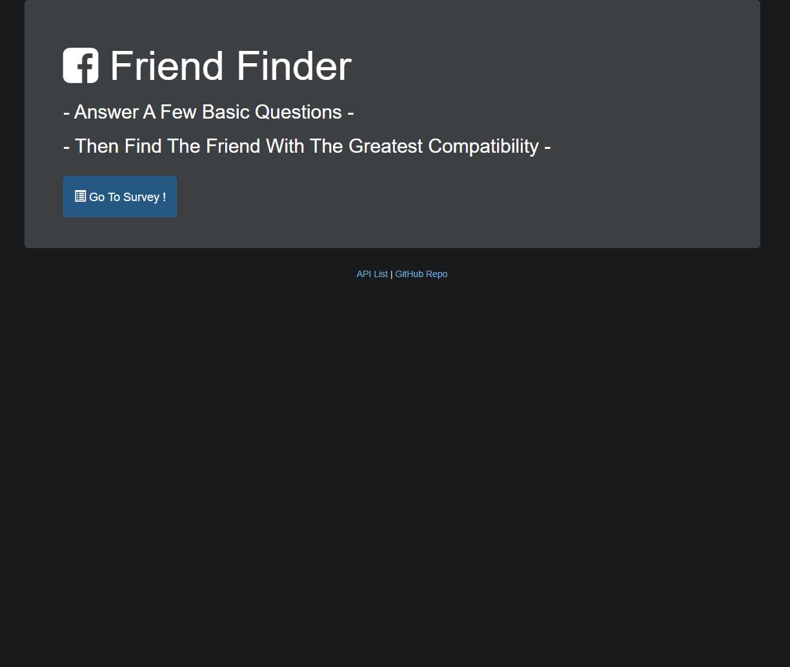
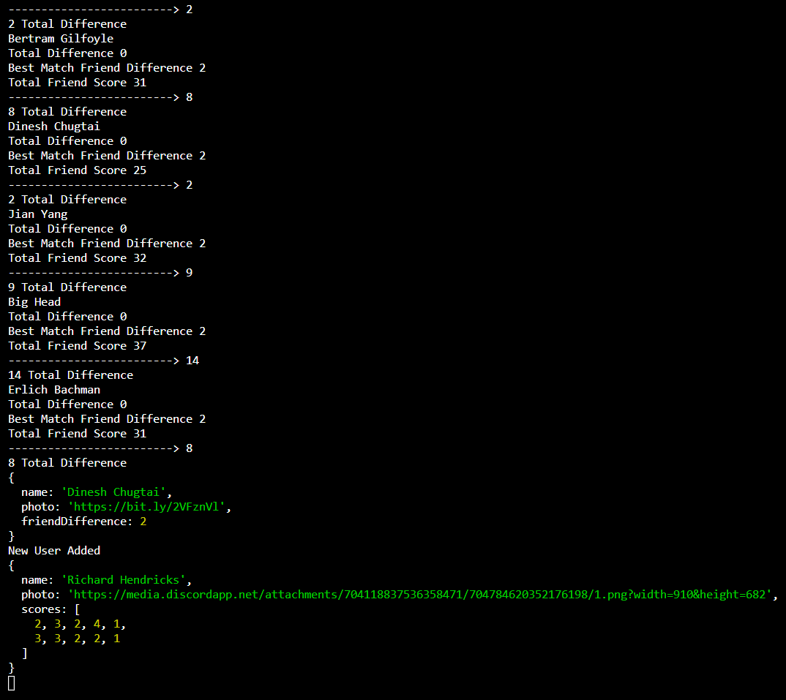

## Friend Finder
Friend Finder is a matchmaking application that takes in user input and finds a person in the database whose answers most closely match your own.
The app will then display the name and picture of the user with the best overall match.

## Getting Started
Download the "images" folder to visualize how Friend Finder works!

## Demo:
On the landing page, you have an option to start the survey, view the raw API data, or visit the GitHub repo for the project.
Friend matching is based on the user's responses to a ten-question survey. The user responds to questions with values from 1 (Strongly Disagree) to 5 (Strongly Agree). When the survey is submitted, an existing user record closest to the current user's responses is found and returned. The closest set of user responses is defined as the set with the lowest absolute difference for all ten questions combined.

## Back-End:
The "best match" is calculated by finding the friend with the minimal difference in scores and then sending that "friend" to the browser as a JSON object, 
A modal is then toggled, displaying the best match to the person who just took the survey.

## Technologies Used:
* HTML5
* CSS - Bootstrap
* Javascript
* Express.js
* Node.js
* NPM Packages
* AJAX - API's
* JSON

# Friend Finder - Project Made by Muhammad Ali